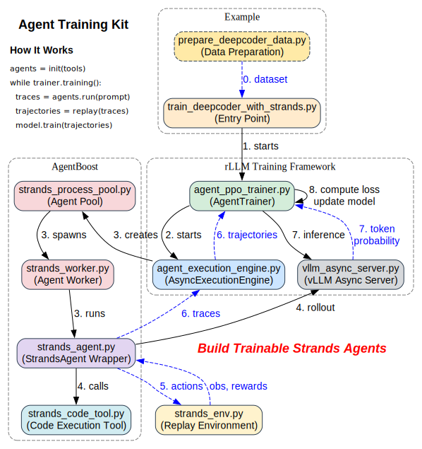
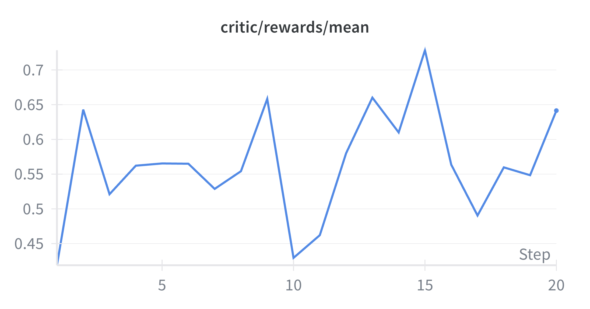
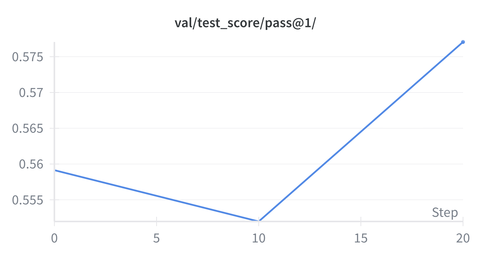
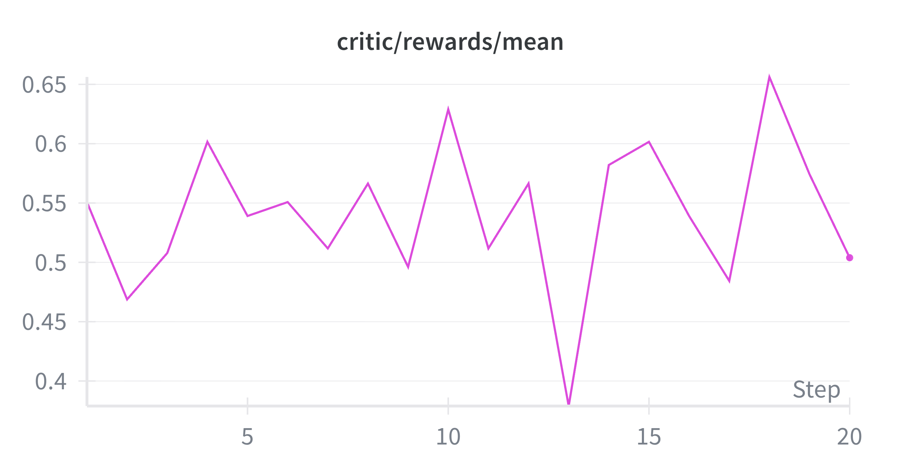
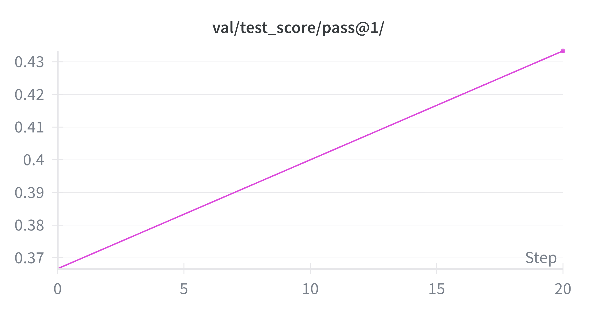

## Agent Training Kit
### Agent Training Kit let developers build Trainable Streands Agent in just a few lines of code.
Agent Training Kit (ATK) makes [Strands Agents](https://github.com/strands-agents/sdk-python) trainable — agents learn from their tool usage and task execution results, improving through experience. ATK adapts [rLLM](https://github.com/rllm-org/rllm) for Strands Agents, handling agent execution, trajectory collection, and reinforcement learning. Agent Training Kit makes existing Strands Agent inference code trainable without modifications—just wrap your agents with ATK and start learning.



*Figure 1: Agent Training Kit training workflow and data flow*

## Code structure
Python file names match the component labels shown in Figure 1.
```bash
├── agentboost
│   ├── agents
│   │   ├── strands_agent.py        # strands agent wrapper
│   │   ├── strands_process_pool.py # parallel process execution of agents
│   │   └── strands_worker.py       # agent worker managed by the process pool
│   ├── environments
│   │   └── strands_env.py          # RL environment for strands agent             
│   └── tools
│       └── strands_code_tool.py    # tools for executing the code
├── apply_patches.py                # install dependencies 
├── examples
│   └── deepcoder
│       ├── prepare_deepcoder_data.py       # prepare dataset for training
│       ├── train_deepcoder_with_strands.py # training python script
│       └── train_deepcoder_with_strands.sh # training bash script
├── modified_rllm_files
│   ├── agent_execution_engine.py   # rLLM execution engine for training agents
│   └── agent_ppo_trainer.py.       # rLLM agent trainer
├── modified_verl_files
│   └── vllm_async_server.py.       # rLLM/veRL vLLM async server
└── setup.py                        # setup python modules
```

### Installation

```bash
curl -LsSf https://astral.sh/uv/install.sh | sh

uv venv ~/venv/agentboost --python=3.12
source ~/venv/agentboost/bin/activate

git clone https://github.com/rllm-org/rllm
cd rllm
git checkout 1fc3c4babfe9a63d809d6bf9a9011df777f30c91
git submodule update --init --recursive

uv pip install torch==2.7.1 torchvision==0.22.1 torchaudio==2.7.1 torchao==0.12.0

# Verify CUDA setup
python -c "import torch; print('PyTorch version:', torch.__version__); print('CUDA available:', torch.cuda.is_available())"

uv pip install -e ./verl
uv pip install git+https://github.com/Dao-AILab/flash-attention.git --no-build-isolation
uv pip install -e .

# Verify vLLM
python -c "import vllm; print('vLLM imported successfully')"

uv pip install 'strands-agents[openai]' strands-agents-tools

cd ..
git clone https://github.com/awslabs/agent-training-kit
cd agent-training-kit
uv pip install -e .
python apply_patches.py

export HF_TOKEN=<YOUR_HF_TOKEN>
wandb login
```

## Quick Start 🎯

### Prepare the dataset
```bash
python examples/deepcoder/prepare_deepcoder_data.py
```

### Run the coding example
```bash
bash examples/deepcoder/train_deepcoder_with_strands.sh
```

### Preliminary Results

Strands Agents show performance improvement within 20 steps of training (640 problems) on both coding and math tasks.

**Coding Tasks**
- Base model - [Qwen/Qwen3-4B-Thinking-2507](https://huggingface.co/Qwen/Qwen3-4B-Thinking-2507)
- Validation - [LiveCodeBench - v5](https://huggingface.co/datasets/PrimeIntellect/LiveCodeBench-v5)

| Training Rewards | Validation Score |
|:---------------:|:------------------:|
|  |  |

**Math Reasoning**
- Base model - [Qwen/Qwen3-4B](https://huggingface.co/Qwen/Qwen3-4B)
- Validation - [AIME-2024](https://huggingface.co/datasets/HuggingFaceH4/aime_2024) 

| Training Rewards | Validation Score|
|:---------------:|:------------------:|
|  |  |


## Tool Usage  🔧
During training on coding tasks, Strands Agents decide when to test their code using
`strands_code_tool` defined in [strands_code_tool.py](agentboost/tools/strands_code_tool.py).

### Stats from training 20 steps

| Category | Count | Percentage |
|----------|-------:|------------:|
| No code submitted | 984 | 18.1% |
| Code submitted without testing | 3842 | 70.6% |
| Code submitted after testing | 625 | 11.4% |

### Tool calling Breakdown

| Status | Count | Percentage |
|--------|------:|-----------:|
| Successful tests | 326 | 52.2% |
| Wrong output | 35 | 5.6% |
| Runtime errors | 261 | 41.8% |
| Other errors | 3 | 0.5% |

Agents called the testing tool in 11.4% of cases. When agents choose to test their code, over half (52.2%) pass immediately. The remaining catches critical issues: runtime errors (41.8%) and wrong outputs (5.6%) that would have resulted in failed submissions. This early error detection allows agents to debug and refine their solutions iteratively.


## Trajectories 🔄

We provide two example trajectories demonstrating how trained agents interact with tools during problem-solving. The [two-step trajectory](examples/deepcoder/exp_traj_2_steps.json) shows a straightforward path where the agent's initial solution passes testing immediately, while the [three-step trajectory](examples/deepcoder/exp_traj_3_steps.json) demonstrates the agent's ability to recover from errors—catching an indentation issue through tool feedback, fixing it, and then submitting the corrected code. These trajectories showcase the complete workflow illustrated in the README figure above.

Here is what the three-step (`init-fix-submit`) trajectory looks like:

```json
[
  {
    "role": "system",
    "content": "You are an expert competitive programming assistant.\n\nCRITICAL: When using strands_code_tool, NEVER put code in function parameters. \nWrite code in ``..."
  },
  {
    "role": "user",
    "content": "You are an expert Python programmer. You will be given a question (problem specification) and will generate a correct Python program that matches the ..."
  },
  {
    "role": "assistant",
    "content": "Okay, let's break down the problem.\n\nWe have a string s (with n letters) and we need to repeatedly remove the first vowel that has a vowel immediately..."
  },
  {
    "role": "user",
    "content": "<tool_response>\nSTATUS: TOOL_ERROR\n\nFound standardized format problem with 1 sample(s)\nTimeout: 5.0s total\n\nTesting extracted code:\n```python\nn = int(..."
  },
  {
    "role": "assistant",
    "content": "Okay, let me try to figure out why the test is failing. The error message says: \"IndentationError: unexpected indent\" at line 2.\n\nLooking at the code ..."
  },
  {
    "role": "user",
    "content": "<tool_response>\nSTATUS: VALIDATION_SUCCESS\n\nFound standardized format problem with 1 sample(s)\nTimeout: 5.0s total\n\nTesting extracted code:\n```python\n..."
  },
  {
    "role": "assistant",
    "content": "Okay, let's see. The user was having issues with their code because of indentation errors when the tool tried to run it. The previous attempts showed ..."
  }
]
```

## Contributing

We welcome contributions and are actively gathering community feedback. See [CONTRIBUTING.md](CONTRIBUTING.md) for:
- Bug reports & feature requests
- Development setup & PRs
- Code of conduct & security
- Sharing feedback on experimental features

## Security

See [CONTRIBUTING](CONTRIBUTING.md#security-issue-notifications) for more information.

## License

This project is licensed under the Apache-2.0 License.
